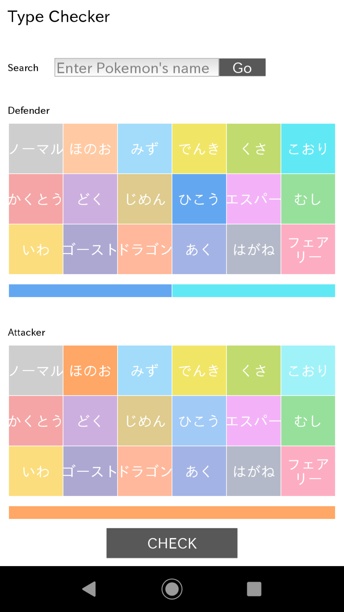
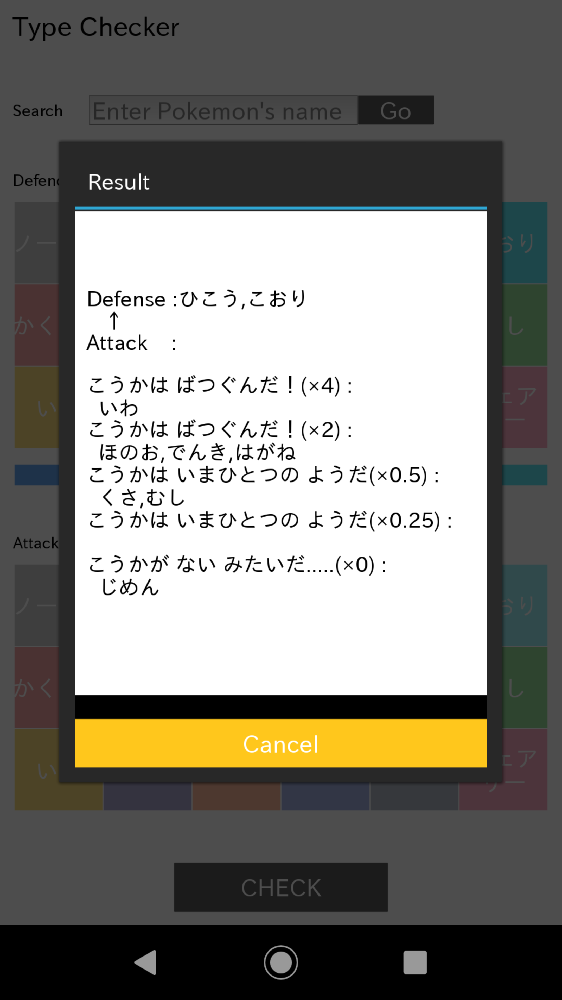
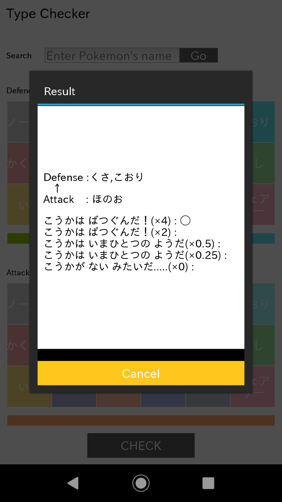
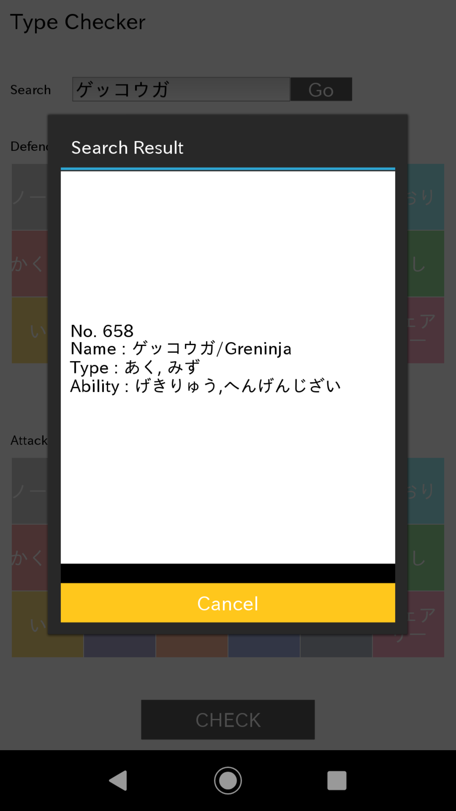

# kivy_type_checker

## 概要
Kivyでポケモンのタイプ相性チェッカーを作成しました。主な機能として 
・攻撃側のわざと防御側のタイプとの相性の確認 
・ポケモンの情報の検索 
を実装しています。

◯タイプ相性の確認機能 
タイル状に並んだタイプのボタンを攻撃側は1つ、防御側は2つまで選びCHECKボタンを押すことで相性を確認することができます。この時 
・攻撃側と防御側両方とも選択した場合：各タイプの相性を表示 
・攻撃側のわざのタイプ又は防御側のポケモンのタイプのみ選択した場合：各タイプとの相性をそれぞれ表示 
ただし効果がふつうのものについては表示されません。

◯ポケモンの情報検索機能 
ポケモンの情報検索にはUSUM API(https://usumapi.nelke.jp) を利用させていただきました。テキストボックスに検索したいポケモンの図鑑ナンバー又は名前(日本語名・英名可)を入力することで対象のポケモンの図鑑ナンバー・名前(日本語名と英名)・タイプ・特性を取得することができます。

   
